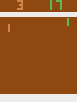

# Pong with Policy Gradients 🔨👷 

Code for a workshop where you'll learn to train a simple reinforcement learning agent to play pong using vanilla policy gradients 💯 

Adapted from [http://karpathy.github.io/2016/05/31/rl/](http://karpathy.github.io/2016/05/31/rl/) and rewritten with PyTorch (CNN policy network incoming!!)

<p align="center"></p>

Reinforcement learning agent (green paddle) vs simple ball-tracking AI (tan paddle).


There are five `### TODO:` statements where you'll need to fill in short pieces of code (no longer than a few lines) defining the policy network and calculating the policy gradients.

Solution and trained network in `solution (spoiler alert!)` folder - but try to do it yourself first! You got this 🤠


What you'll need:

- Python >=3.6
- Pytorch
- Tensorflow >=2.0
- OpenAI Gym w/ Atari (`$ pip install "gym[atari]"`)


To run it yourself:

```bash
$ python pong.py [--render]
```

where `--render` is an optional flag that renders pong games and slows them down to a watchable speed.


To view [TensorBoard](https://www.tensorflow.org/tensorboard) visualizations during training, open a separate terminal and run:

```bash
$ tensorboard --logdir tensorboard_logs
```

and visit [http://localhost:6006/](http://localhost:6006/).
